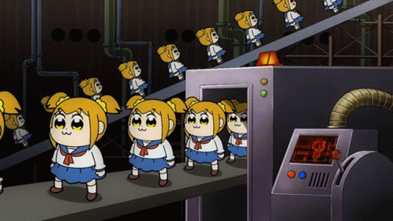

<h1 align="center">EXAMPLE</h1>

<div align="center">
    <a href="https://t.me/robinisrobot" target="_blank">
        
</div>

<h2 align="center" style="font-size: 2em"><a href="https://t.me/robinisrobinisrobot" target="_blank">DEMO - @robionisrobot</a></h2>

#### Robin is always ready to keep you company and play with you!

### INSTALLATION

```
git clone https://github.com/Avdushin/ROBIN
cd ROBIN
make install
```
#### EDIT `.env` file:

```
BOT_TOKEN=your:token
```

You can get a **BOT TOKEN** from [@BotFather](https://t.me/BotFather)

#### To start bot please type `make` or `make start`

### DEPENDENCIES

```
aiogram==2.21
async-timeout==4.0.2
emoji==2.0.0
python-dotenv==0.20.0
```

<p align="center">2022 © <a href="https://github.com/Avdushin" target="_blank">AVDUSHIN</a></p>